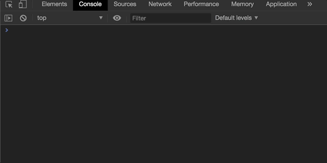
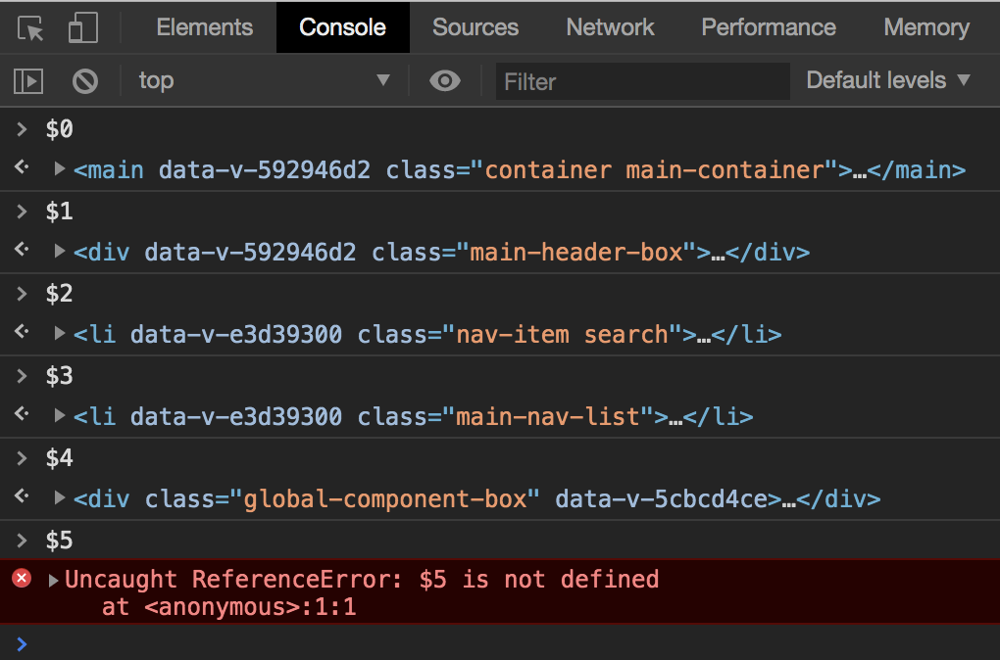
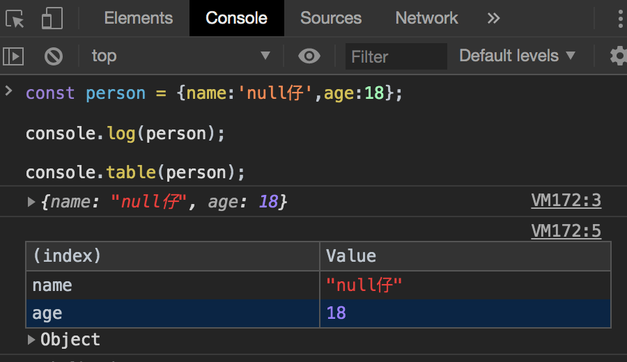
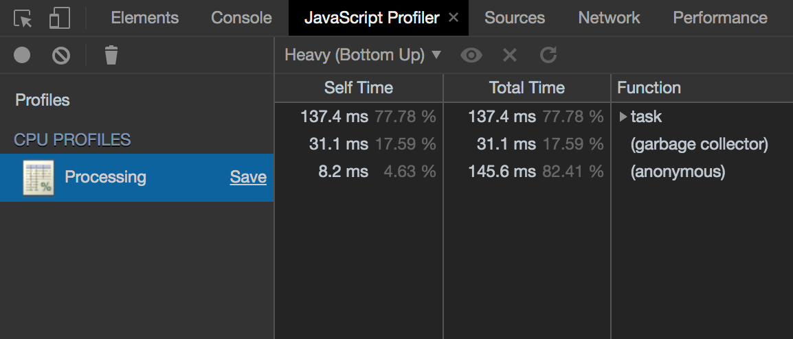
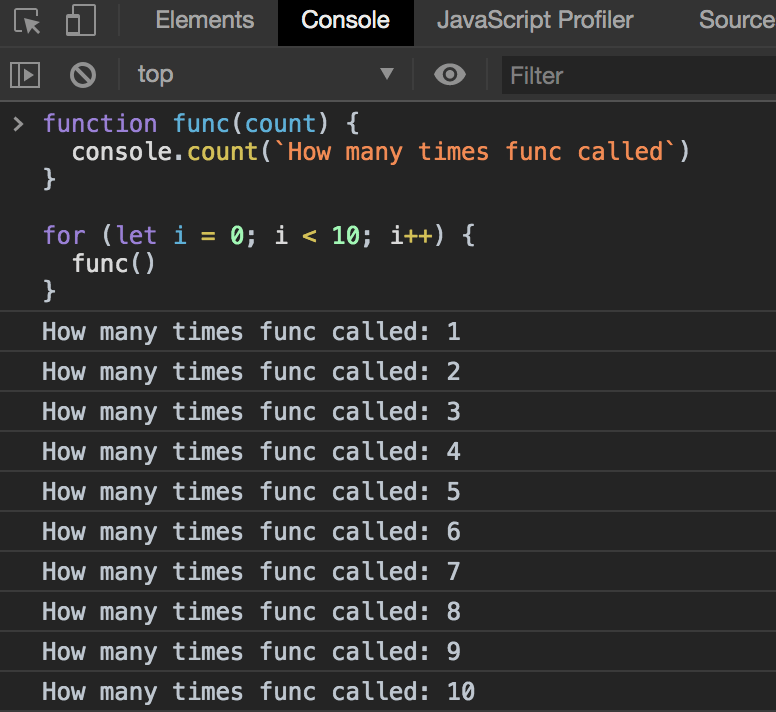

## 控制台中直接访问页面元素

在元素面板选择一个元素,然后在控制台输入$0,就会在控制台中得到刚才选中的元素。如果页面中已经包含了jQuery,你也可以使用$(\$0)来进行选择。

你也可以反过来,在控制台输出的 DOM 元素上右键选择 Reveal in Elements Panel 来直接在 DOM 树种查看。

## 访问最近的控制台结果

在控制台输入\$\_可以获控制台最近一次的输出结果。

## 访问最近选择的元素和对象

控制台会存储最近 5 个被选择的元素和对象。当你在元素面板选择一个元素或在分析器面板选择一个对象,记录都会存储在栈中。 可以使用$x来操作历史栈,x是从0开始计数的,所以$0 表示最近选择的元素,\$4 表示最后选择的元素。

## 选择元素

- \$() - 返回满足指定 CSS 规则的第一个元素，此方法为 document.querySelector()的简化。

- \$\$() - 返回满足指定 CSS 规则的所有元素，此方法为 querySelectorAll()的简化。

- \$x() - 返回满足指定 XPath 的所有元素。

## 使用 console.table

该命令支持以表格的形式输出日志信息。打印复杂信息时尝试使用 console.table 来替代 console.log 会更加清晰。

## 使用 console.dir

console.dir(object)命令可以列出参数 object 的所有对象属性。

## 复制 copy

你可以通过 copy 方法在控制台里复制你想要的东西。

## 耗时监控

通过调用 time()可以开启计时器。你必须传入一个字符串参数来唯一标记这个计时器的 ID。当你要结束计时的时候可以调用 timeEnd()，并且传入指定的名字。计时结束后控制台会打印计时器的名字和具体的时间。

## 分析程序性能

在 DevTools 窗口控制台中，调用 console.profile()开启一个 JavaScript CPU 分析器.结束分析器直接调用 console.profileEnd().

具体的性能分析会在分析器面板中

## 统计表达式执行次数

count()方法用于统计表达式被执行的次数,它接受一个字符串参数用于标记不同的记号。如果两次传入相同的字符串,该方法就会累积计数。

## 清空控制台历史记录

可以通过下面的方式清空控制台历史:

- 在控制台右键，或者按下 Ctrl 并单击鼠标，选择 Clear Console。
- 在脚本窗口输入 clear()执行。
- 在 JavaScript 脚本中调用 console.clear()。
- 使用快捷键 Cmd + K (Mac) Ctrl + L (Windows and Linux)。

